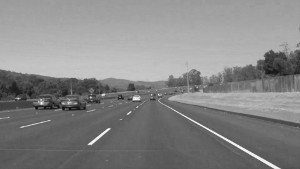

# **Finding Lane Lines on the Road** 

This repository is the first project for Auto Driving Cars Nano Degree by Audacity. The project uses canny edge detection and hough transform to find lane lines on the road.   

**Important Notes**

* please note that there is a folder with the name test_image_output. it contains dashed line detected images 
* there are two functions imporoved_line_draw and line_draw, the last is for dash lines to be used in hough transform. 

[//]: # (Image References)

[image1]: ./examples/grayscale.jpg "Grayscale"
[image2]: ./examples/edge.png "edge"
[image3]: ./examples/hough.png "hough"
[image4]: ./examples/merged1.png "Color 1"
[image5]: ./examples/merged2.png "Color 2"
[video1]: ./examples/video1.gif "Color 2"

---

### 1. Describe your pipeline. As part of the description, explain how you modified the draw_lines() function.

The pipline is made of several steps: 

* convert the image to gray scale 8 bit:
 

 

* blur the image to remove noise then apply canny edge detection method
 

 

* masking then applying hough transform to find lane lines:
 

 

* Overlying the detected lanes over the image 
 

### **Improving draw_lines function** 

Conecting discontinous lines can be done by extrapolating the slope of each line and its intercept . Then the 
average of all the slopes and intercepts will give approximatly a connected line over the dashes. 
 

 

### **applying it on a video**

A video is just a series of images 

 

 

### 2. Identify potential shortcomings with your current pipeline

Shortcomings with the pipleines are: 

* In curvy road where slope changes constantly the lane lines will not be identified. 
* When an object comes to the front of the car it will interfere with its lane detection. 
* it will not be able to detect cats eye on the road 

### 3. Suggest possible improvements to your pipeline
* To use curvy masking 
* Instead of detecting lanes by their slopes we can split the x axis into two one for the left lane and one for the right lane